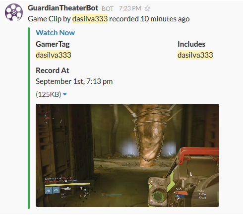
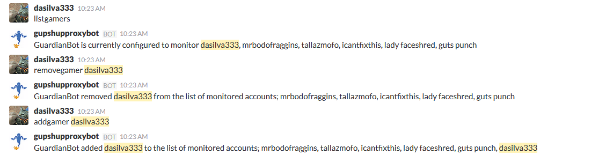

# GuardianTheaterSlackbot

Automatically receive notifications on Slack for subscribed Xbox gamertags having recorded a video game clip in the same activity as you.

## Messages Preview

## Install

npm install

## Run the server

node index.js

## Configuration for server daemon

Rename the config.json.example file to config.json and edit the following two fields to match your preferences:

### SlackWebhook: 

Open Slack, in the left side menu above Customize Slack there is Apps & Intergrations > Manage > Custom Intergrations > Incoming Webhooks > Add Configuratoin.

Paste the Webhook URL provided by the page into that field.

### XboxGamerTags: 

This is a list of Xbox GamerTags to monitor, if you enter multiple gamertags the 'In Activity' field in the message provides all the Gamertags found for that specific clip.

eg. [ 'gamertag1', 'gamertag2' ]

## Configuration for Proxy Bot

Visit the following url:

[Slack Proxy Bot](https://amarilloplaytestgroup.slack.com/apps/A0RN1V1PV-gupshup-proxy-bot)

Add the bot to your Slack group, send a private message to the bot with the following command:

* @gupshupproxybot: proxy guardianbot

You should get back: 'Bot mapped successfully Thanks for adding me. You are: ', now you may configure the bot to communicate with your server running the daemon.

* sethost http://myremotedomain.com:1337

now you may issue the following commands to the bot:

* listgamers - provides a list of who is subscribed to be monitored

* addgamer {gamertag} - adds the gamertag to the list of users to be monitored

* removegamer {gamertag} - remvoes the gamertag fromt he list of users monitored
