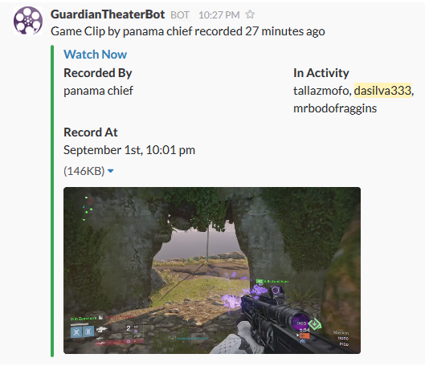

# GuardianTheaterSlackbot

Automatically receive notifications on Slack for subscribed Xbox gamertags having recorded a video game clip in the same activity as you.

## Preview

## Install

npm install

## Run the server

node index.js

## Configuration

Edit the config.json file:

### SlackWebhook: 

Open Slack, in the left side menu above Customize Slack there is Apps & Intergrations > Manage > Custom Intergrations > Incoming Webhooks > Add Configuratoin.

Paste the Webhook URL provided by the page into that field.

### XboxGamerTags: 

This is a list of Xbox GamerTags to monitor, if you enter multiple gamertags the 'In Activity' field in the message provides all the Gamertags found for that specific clip.

eg. [ 'gamertag1', 'gamertag2' ]

